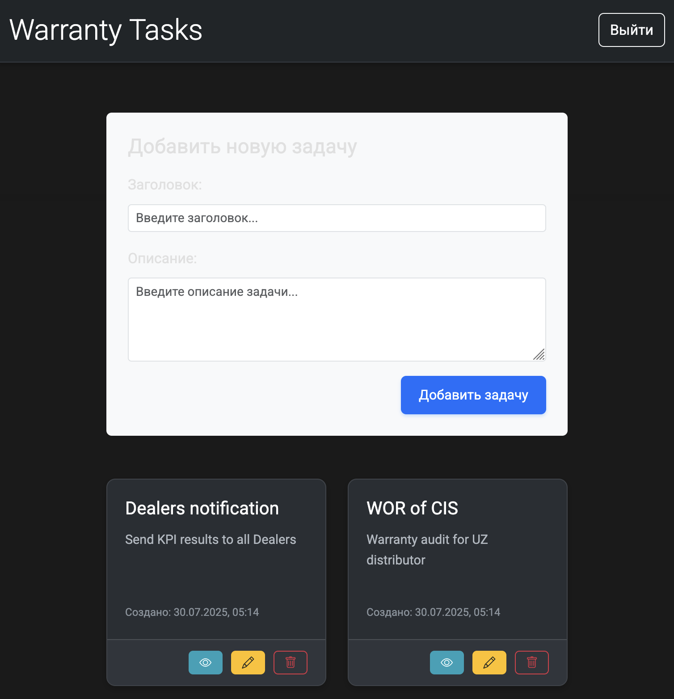
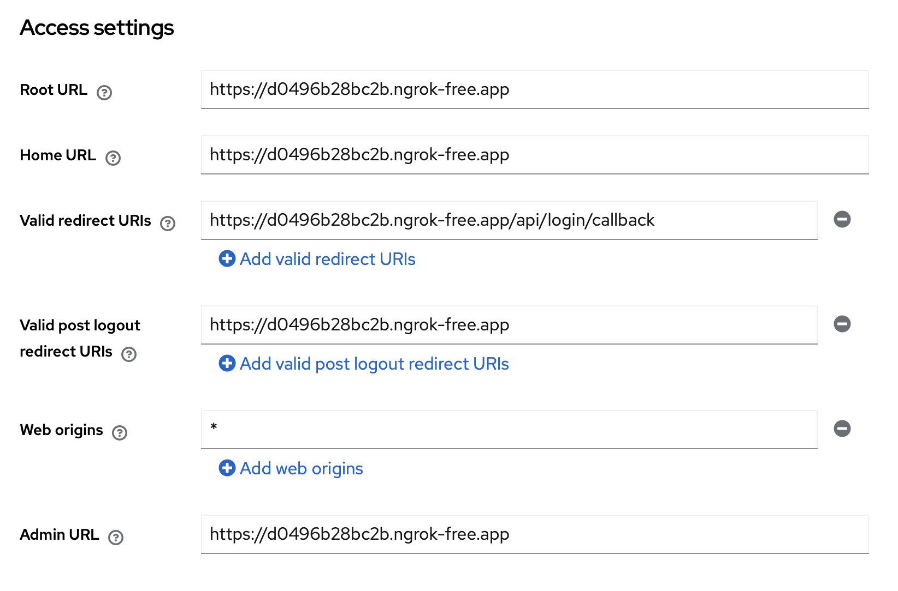
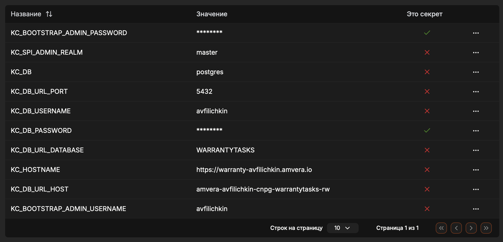

# FastAPI | Keycloak

## Стек технологий


CRUD веб-приложение для задач.

- Keycloak с внутренней базой данных;
- API для управления задач: добавление, просмотр, редактирование, удаление задач и другие необходимые операции;
-  Фронтенд с использованием Jinja2, HTML, CSS и JavaScript.

Keycloak – это бесплатное решение с открытым исходным кодом для управления идентификацией и доступом (Identity and Access Management, IAM). Основная задача Keycloak – обеспечить механизм единого входа (Single Sign-On, SSO), позволяющий пользователям аутентифицироваться один раз и получать доступ к различным приложениям без необходимости повторного ввода учетных данных.

## Запуск проекта

```
uvicorn app.main:app --host 0.0.0.0 --port 8000
```

После запуска откройте браузер по адресу http://localhost:8000. Затем создайте туннель, чтобы ваше приложение стало доступным извне и можно было интегрировать проект с Keycloak. Если используете Ngrok, введите команду для запуска.

```
ngrok http 8000
```

<table>
  <tr>
    <td align="center"><br><b>Экран входа</b></td>
    <td align="center"><br><b>Основное приложение</b></td>
  </tr>
  <tr>
    <td align="center"><br><b>Keycloak UI</b></td>
    <td align="center"><br><b>Панель Amvera</b></td>
  </tr>
</table>