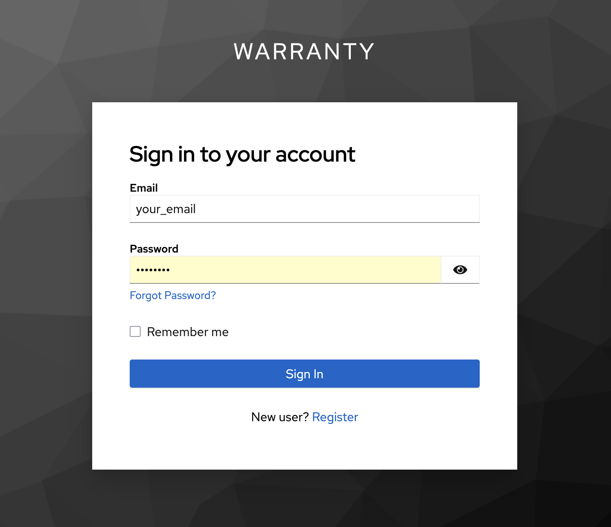

# FastAPI | Keycloak

## Стек технологий


CRUD веб-приложение для задач.

- Keycloak с внутренней базой данных;
- API для управления задач: добавление, просмотр, редактирование, удаление задач и другие необходимые операции;
-  Фронтенд с использованием Jinja2, HTML, CSS и JavaScript.

Keycloak – это бесплатное решение с открытым исходным кодом для управления идентификацией и доступом (Identity and Access Management, IAM). Основная задача Keycloak – обеспечить механизм единого входа (Single Sign-On, SSO), позволяющий пользователям аутентифицироваться один раз и получать доступ к различным приложениям без необходимости повторного ввода учетных данных.

## Структура проекта

```
KEYCLOAC_TASKS/
├── app/                             # Основной модуль приложения
│   ├── api/                         # API-роуты и схемы данных
│   │   ├── router.py                # Основные HTTP-эндпоинты
│   │   └── schemas.py              # Pydantic-схемы для валидации
│   ├── dao/                         # Работа с БД (Data Access Layer)
│   │   ├── base.py                  # Базовые модели SQLAlchemy
│   │   ├── dao.py                   # DAO-функции для операций
│   │   ├── database.py              # Подключение и инициализация БД
│   │   └── models.py                # SQLAlchemy-модели
│   ├── migration/                   # Alembic миграции (пустая/инициализируемая)
│   ├── pages/                       # FastAPI pages (Jinja-шаблоны, роутинг)
│   │   └── router.py                # Роутинг страниц
│   ├── services/                    # Сервисы и зависимости
│   │   ├── auth_dep.py              # Зависимости авторизации
│   │   ├── dao_dep.py               # DAO-зависимости
│   │   └── keycloak_client.py      # Работа с Keycloak
│   ├── static/                      # Статические файлы (JS, CSS)
│   │   ├── script.js                # Логика фронтенда
│   │   └── style.css                # Стилизация интерфейса
│   ├── templates/                   # HTML-шаблоны Jinja2
│   ├── config.py                    # Настройки приложения
│   └── main.py                      # Точка входа FastAPI
├── data/                            # Каталог с данными (например, БД)
│   └── db.sqlite3                   # SQLite база данных
├── examples/                        # Скриншоты и примеры для README
│   ├── amvera.png
│   ├── app.png
│   ├── keycloak.png
│   └── sign_in.png
├── venv/                            # Виртуальное окружение Python
├── .env                             # Файл конфигурации окружения
├── .env_example.txt                 # Пример .env файла
├── .gitignore                       # Исключения для git
└── alembic.ini                      # Настройки Alembic миграций
```

## Запуск проекта

```
uvicorn app.main:app --host 0.0.0.0 --port 8000
```

После запуска откройте браузер по адресу http://localhost:8000. Затем создайте туннель, чтобы ваше приложение стало доступным извне и можно было интегрировать проект с Keycloak. Если используете Ngrok, введите команду для запуска.

```
ngrok http 8000
```

<table>
  <tr>
    <td align="center"><br><b>Экран входа</b></td>
    <td align="center"><br><b>Основное приложение</b></td>
  </tr>
  <tr>
    <td align="center"><br><b>Keycloak UI</b></td>
    <td align="center"><br><b>Панель Amvera</b></td>
  </tr>
</table>